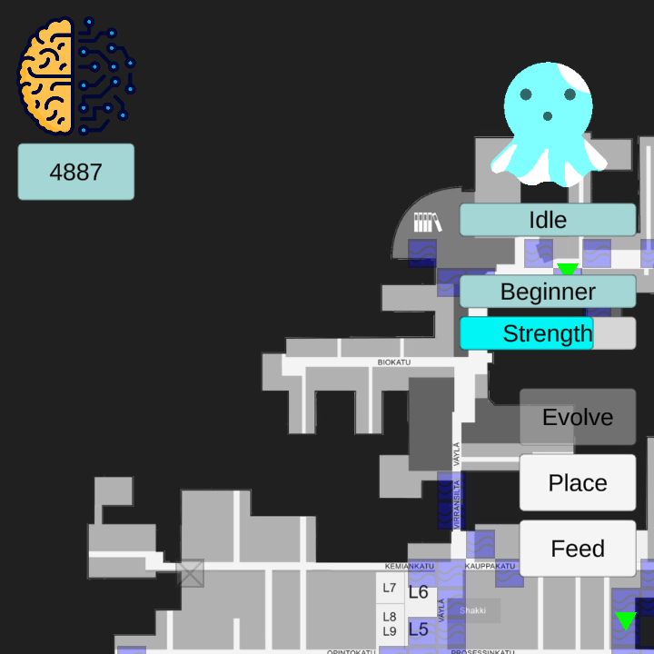

<link rel="stylesheet" href="./style.css">

Last updated: 16/09/2025 

>Welcome to my portfolio!

Below is a timeline of my most notable projects.

### Autumn 2025

[Procrastinot - Mobile App Prototype - Flutter Framework](https://etex99.github.io/portfolio/procrastinot)

### Spring 2024

[MS Project - Location-based AR Game prototype - Unity3D Game Engine](https://etex99.github.io/portfolio/ms_project)

### Spring 2021

[Mieliala kysely (Anti-bullying App) - Mobile App Prototype - Microsoft Xamarin Platform](https://etex99.github.io/portfolio/mieliala_kysely)

### Autumn 2020

[Arcane Onslaught - Game Prototype - Unity3D Game Engine](https://etex99.github.io/portfolio/arcane_onslaught)

